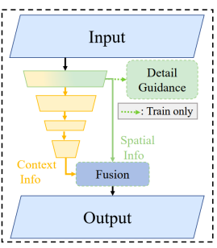
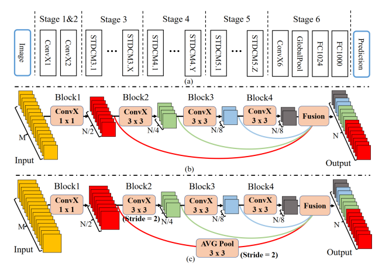

# **STDC MODEL**
### <a href="https://arxiv.org/pdf/2104.13188">Paper</a>

# **Description**
STDC (Spatial Pyramid Dilated Convolution) is a semantic segmentation model that focuses on efficient feature extraction and high-resolution segmentation. It employs a spatial pyramid dilated convolution strategy to capture multi-scale contextual information while maintaining computational efficiency.
This is the image of the model architecture:

As you can see, the spatial path of BiSeNet is replaced with a Detail guidance module, helping the low layers to better extract the details of the image.
So overall this are the main additions:
- We design a Short-Term Dense Concatenate module (STDC module) to extract deep features with scalable
receptive field and multi-scale information. This module promotes the performance of our STDC network
with affordable computational cost.
- We propose the Detail Aggregation module to learn the
decoder, leading to more precise preservation of spatial
details in low-level layers without extra computation
cost in the inference time.
   
This is the image of the model architecture:

NOTE: The convX blocks are convolutional blocks having a convolution, then a batch normalization and a ReLU activation function.
Part a is the model.
Part b and C are the Detail Aggregation module, which is a module that helps the low layers to better extract the details of the image.

### **Backbone**
The backbone of STDC is a custom-designed architecture that integrates the STDC module for efficient feature extraction. It does not rely on external pre-trained networks like ResNet, allowing it to be lightweight and optimized for real-time performance.

### **Key Differences Compared to BiSeNet V2**
- **Spatial Pyramid Dilated Convolution:** STDC uses a spatial pyramid dilated convolution strategy to capture multi-scale contextual information, enhancing the model's ability to understand complex scenes.
- **Detail Aggregation Module:** This module improves the preservation of spatial details in low-level layers, allowing for more precise segmentation without additional computational cost during inference.
- **Short-Term Dense Concatenate Module:** The STDC module enables scalable receptive field and multi-scale information extraction, promoting performance while keeping computational costs manageable.
- **Custom Backbone:** Unlike BiSeNet V2, which uses a lightweight backbone, STDC employs its own architecture designed specifically for efficient feature extraction and real-time performance.

### **Dice Loss**
Dice Loss is a loss function commonly used in semantic segmentation tasks, particularly when dealing with imbalanced datasets. It measures the overlap between the predicted segmentation and the ground truth, focusing on the regions of interest. The formula for Dice Loss is:

$\text{Dice Loss} = 1 - \frac{2 \cdot |X \cap Y|}{|X| + |Y|} $

Where:
- \(X\) is the set of predicted segmentation pixels.
- \(Y\) is the set of ground truth segmentation pixels.
This loss function is particularly effective in scenarios where the foreground class is much smaller than the background, as it emphasizes the importance of correctly segmenting the foreground regions.